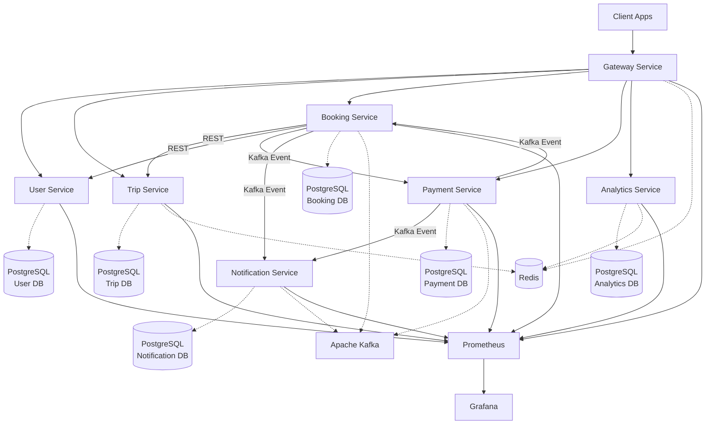

# Архитектура TravelMaster Platform

## Обзор

TravelMaster Platform — это микросервисная система для бронирования и управления путешествиями, построенная на современных технологиях Java и Spring Boot.

## Архитектурные принципы

- **Микросервисная архитектура** — каждый сервис автономен и масштабируется независимо
- **Domain-Driven Design** — чёткое разделение бизнес-доменов
- **API-first подход** — все взаимодействия через REST API
- **Event-driven архитектура** — асинхронная коммуникация через Kafka
- **Cloud-native** — готовность к развёртыванию в облаке

## Компоненты системы

### 1. Gateway Service

**Назначение:** Единая точка входа для всех клиентских запросов.

**Функциональность:**
- Маршрутизация запросов к микросервисам
- JWT аутентификация и авторизация
- Rate limiting для защиты от DDoS
- CORS обработка
- Агрегация логов и метрик

**Технологии:** Spring Cloud Gateway, Redis, JWT

**Порт:** 8080

### 2. User Service

**Назначение:** Управление пользователями и аутентификация.

**Функциональность:**
- Регистрация и авторизация пользователей
- OAuth 2.0 / OpenID Connect интеграция
- Управление профилями
- RBAC (Role-Based Access Control)
- Управление ролями: TRAVELER, AGENT, ADMIN

**Технологии:** Spring Security, PostgreSQL, JWT, OAuth 2.0

**Порт:** 8081

**База данных:** `travelmaster_user`

### 3. Trip Service

**Назначение:** Управление поездками и маршрутами.

**Функциональность:**
- CRUD операции для поездок
- Поиск и фильтрация маршрутов
- Интеграция с внешними провайдерами (Amadeus, Booking)
- Кеширование популярных маршрутов
- Управление сегментами: перелёты, отели, трансферы

**Технологии:** Spring Boot, PostgreSQL, Redis, WebClient

**Порт:** 8082

**База данных:** `travelmaster_trip`

### 4. Booking Service

**Назначение:** Обработка бронирований.

**Функциональность:**
- Создание и управление бронированиями
- State machine для статусов (PENDING → CONFIRMED → PAID → CANCELLED)
- Saga Pattern для распределённых транзакций
- Компенсирующие транзакции при ошибках
- Kafka events для уведомлений

**Технологии:** Spring Boot, PostgreSQL, Kafka, Spring State Machine

**Порт:** 8083

**База данных:** `travelmaster_booking`

### 5. Payment Service

**Назначение:** Обработка платежей.

**Функциональность:**
- Интеграция с платёжными шлюзами (T-Bank, CloudPayments)
- Токенизация платёжных данных
- PCI DSS compliance
- Audit logging всех транзакций
- Обработка возвратов и частичных возвратов
- Idempotency для предотвращения дублирующих платежей

**Технологии:** Spring Boot, PostgreSQL, Kafka, Encryption

**Порт:** 8084

**База данных:** `travelmaster_payment`

### 6. Notification Service

**Назначение:** Отправка уведомлений пользователям.

**Функциональность:**
- Email уведомления (Spring Mail)
- SMS уведомления
- Push notifications
- Шаблонизация через FreeMarker
- Retry mechanism для failed уведомлений
- Kafka consumers для событий

**Технологии:** Spring Boot, Kafka, FreeMarker, Spring Mail

**Порт:** 8085

**База данных:** `travelmaster_notification`

### 7. Analytics Service

**Назначение:** Аналитика и агрегация данных.

**Функциональность:**
- Агрегация данных по бронированиям
- Статистика по доходам
- Аналитика загрузки системы
- REST API для дашборда менеджера
- Кеширование аналитических данных
- Экспорт отчётов в CSV/Excel

**Технологии:** Spring Boot, PostgreSQL, Redis, Materialized Views

**Порт:** 8086

**База данных:** `travelmaster_analytics`

## Диаграмма взаимодействия



## Паттерны взаимодействия

### Синхронная коммуникация (REST)

Используется для запросов, требующих немедленного ответа:

```
Client → Gateway → Service → Response
```

Примеры:
- Получение информации о поездке
- Проверка статуса бронирования
- Получение профиля пользователя

### Асинхронная коммуникация (Kafka)

Используется для событийно-ориентированной обработки:

```
Service A → Kafka Topic → Service B (Consumer)
```

События:
- `booking.created` — создано бронирование
- `booking.confirmed` — бронирование подтверждено
- `payment.completed` — платёж выполнен
- `payment.failed` — платёж не прошёл
- `trip.cancelled` — поездка отменена

### Saga Pattern

Для распределённых транзакций используется Saga Pattern:

```
1. Booking Service создаёт бронирование (PENDING)
2. Trip Service резервирует места
3. Payment Service обрабатывает платёж
4. Notification Service отправляет уведомление
```

При ошибке на любом шаге запускаются компенсирующие транзакции:

```
Payment Failed → Cancel Reservation → Update Booking Status → Notify User
```

## Слои архитектуры

Каждый сервис построен по принципам Clean Architecture:

```
┌─────────────────────────────────────┐
│         Presentation Layer          │
│   (Controllers, REST Endpoints)     │
└──────────────┬──────────────────────┘
               │
┌──────────────▼──────────────────────┐
│         Application Layer           │
│    (Services, Use Cases, DTOs)      │
└──────────────┬──────────────────────┘
               │
┌──────────────▼──────────────────────┐
│           Domain Layer              │
│   (Entities, Business Logic)        │
└──────────────┬──────────────────────┘
               │
┌──────────────▼──────────────────────┐
│       Infrastructure Layer          │
│  (Repositories, External APIs)      │
└─────────────────────────────────────┘
```

### Presentation Layer
- REST контроллеры
- Request/Response DTOs
- Валидация входных данных
- Exception handlers

### Application Layer
- Business services
- Use case orchestration
- DTO ↔ Entity маппинг (MapStruct)
- Транзакционное управление

### Domain Layer
- Domain entities
- Business logic
- Domain events
- Value objects

### Infrastructure Layer
- JPA repositories
- External API clients
- Kafka producers/consumers
- Configuration

## Безопасность

### Аутентификация и авторизация

```
1. User → Gateway (login credentials)
2. Gateway → User Service (validate)
3. User Service → JWT Token
4. Client uses JWT for all requests
5. Gateway validates JWT on each request
```

### Защита данных

- **Шифрование в transit:** TLS 1.3 для всех соединений
- **Шифрование at rest:** Шифрование чувствительных полей в БД
- **Токенизация:** Платёжные данные не хранятся, только токены
- **Audit logging:** Все операции с персональными данными логируются

### Compliance

- **ФЗ-152:** Защита персональных данных российских граждан
- **PCI DSS:** Соответствие стандартам обработки платёжных данных
- **GDPR:** Право на забвение, экспорт данных

## Масштабирование

### Горизонтальное масштабирование

Все сервисы stateless и могут масштабироваться горизонтально:

```yaml
# Kubernetes HPA
minReplicas: 2
maxReplicas: 10
targetCPUUtilization: 70%
```

### Вертикальное масштабирование

Resource limits настраиваются для каждого сервиса:

```yaml
resources:
  requests:
    memory: "512Mi"
    cpu: "250m"
  limits:
    memory: "2Gi"
    cpu: "1000m"
```

### Database scaling

- **Read replicas** для чтения
- **Connection pooling** (HikariCP)
- **Caching** (Redis) для горячих данных
- **Partitioning** для больших таблиц

## Мониторинг и наблюдаемость

### Метрики (Prometheus)

- JVM метрики (heap, threads, GC)
- HTTP метрики (latency, throughput, errors)
- Database метрики (connections, query time)
- Business метрики (bookings, payments, revenue)

### Логирование

- **Structured logging** (JSON format)
- **Correlation ID** для трейсинга запросов
- **Centralized logging** (ELK Stack)
- **Log levels:** DEBUG, INFO, WARN, ERROR

### Distributed Tracing

- Micrometer + Zipkin
- Trace ID передаётся через все сервисы
- Визуализация цепочки вызовов

### Health Checks

```
GET /actuator/health/liveness  - Pod жив?
GET /actuator/health/readiness - Pod готов принимать трафик?
```

## Resilience

### Circuit Breaker

Защита от каскадных сбоев:

```java
@CircuitBreaker(name = "tripService")
public Trip getTripDetails(Long tripId) {
    // External call
}
```

### Retry

Автоматические повторные попытки:

```java
@Retry(name = "paymentGateway", maxAttempts = 3)
public PaymentResponse processPayment(Payment payment) {
    // Payment processing
}
```

### Rate Limiting

Защита от перегрузки:

```yaml
redis-rate-limiter:
  replenishRate: 10  # токенов в секунду
  burstCapacity: 20  # максимальный burst
```

### Timeouts

Защита от зависших запросов:

```yaml
spring:
  cloud:
    gateway:
      httpclient:
        connect-timeout: 5000
        response-timeout: 30s
```

## Развёртывание

### Local Development

```bash
docker-compose up -d
mvn spring-boot:run
```

### Kubernetes

```bash
helm install travelmaster ./helm/travelmaster \
  --values values-prod.yaml
```

### CI/CD Pipeline

```
Code Push → GitHub Actions → Build → Test → Docker Build → Push to Registry → Deploy to K8s
```

## Технический стек

| Компонент | Технология | Версия |
|-----------|-----------|--------|
| Language | Java | 21 |
| Framework | Spring Boot | 3.2.x |
| Gateway | Spring Cloud Gateway | 4.x |
| Database | PostgreSQL | 14 |
| Cache | Redis | 7 |
| Messaging | Apache Kafka | 3.6 |
| Container | Docker | 24.x |
| Orchestration | Kubernetes | 1.28+ |
| Monitoring | Prometheus + Grafana | Latest |
| Tracing | Zipkin | Latest |

## Дальнейшее развитие

### Короткий срок (3-6 месяцев)

- Интеграция с реальными провайдерами (Amadeus, Booking.com)
- Мобильное приложение (iOS/Android)
- Расширенная аналитика с ML рекомендациями
- Multilingual support

### Средний срок (6-12 месяцев)

- GraphQL API для frontend
- WebSocket для real-time updates
- Service Mesh (Istio) для advanced routing
- Multi-region deployment

### Долгий срок (12+ месяцев)

- AI-powered trip planning
- Blockchain для loyalty программы
- IoT интеграция (умные чемоданы)
- AR/VR preview поездок

---

**Версия:** 1.0  
**Последнее обновление:** 31 октября 2025  
**Авторы:** TravelMaster Architecture Team

